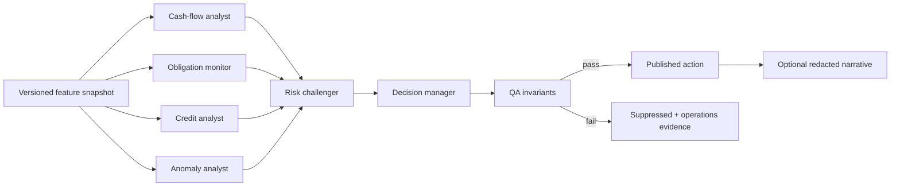

# Decision, analyst, and agent system

## Principle

The application may contain several specialised analytical “agents”, but financial truth is not decided by a free-form conversation. Each role has a typed input, a bounded authority, a deterministic or versioned implementation, and a machine-verifiable output. A Decision Manager combines evidence; it does not erase disagreements.

## Roles

| Role | Responsibility | Authority |
|---|---|---|
| Ingestion monitor | validate source, schema, cursor, counts, and quarantine | may accept/reject ingestion; cannot create advice |
| Reconciliation analyst | duplicates, transfers, authorisation/posting/reversal, balance gaps | proposes/creates evidence links under deterministic rules |
| Cash-flow analyst | salary rhythm, daily forecast, runway, safe-to-spend | computes typed features; cannot move money |
| Obligation monitor | bills, EMIs, subscriptions, due dates, funding coverage | creates time-sensitive alerts; cannot pay |
| Credit analyst | per-bureau report facts, utilization, enquiry/tradeline discrepancy | cannot average scores or promise impact |
| Benefits/eligibility analyst | transparent rule assessment and partner facts | estimates only; cannot claim lender approval |
| Anomaly analyst | unusual amount/time/merchant/category patterns | flags evidence; cannot label fraud as fact |
| Risk challenger | searches for missing/stale/conflicting evidence and downside scenarios | may downgrade/suppress advice; cannot create a positive claim without evidence |
| Decision manager | resolves priority/conflicts and publishes a recommended action | bounded by policy, disclosure, and safety gates |
| AI narrative analyst | converts validated/redacted result into plain language and questions | advisory only; cannot calculate, approve, rank offers, or read raw records |
| QA oracle | checks invariants, expected decisions, and policy/version compatibility | blocks release/decision publication on defined failures |

These are application roles, not autonomous production employees with unrestricted credentials. Human operations, compliance, and support retain approval for real money movement, disputed financial facts, model release, partner offers, and incident reporting.

## Typed output

```ts
type AnalystFinding = {
  findingId: string;
  role: AnalystRole;
  severity: 'info' | 'attention' | 'urgent';
  claim: string;
  evidenceRefs: string[];
  sourceWatermark: string;
  confidenceBps: number;        // 0..10000, integer basis points
  uncertainty: string[];
  policyVersion: string;
  expiresAt: string;
};

type ManagedDecision = {
  decisionId: string;
  action: string;
  alternatives: string[];
  acceptedFindings: string[];
  rejectedFindings: Array<{ findingId: string; reason: string }>;
  conflicts: string[];
  impactMinor?: number;
  currency?: 'INR';
  confidenceBps: number;
  policyVersion: string;
  status: 'proposed' | 'published' | 'suppressed' | 'expired';
};
```

## Decision pipeline



## Hard invariants

- A stale or missing source cannot be described as current.
- A recommendation cannot exceed its evidence/feature expiry.
- The Decision Manager cannot increase confidence above the strongest supporting evidence unless a documented combination rule proves it.
- Contradictory critical findings suppress positive eligibility/affordability language until resolved.
- Corporate expenses do not reduce personal safe-to-spend unless explicitly transferred into personal responsibility.
- Owned-account transfers do not count as income or spending.
- Reversed transactions have zero final expense impact unless another posting remains.
- All money arithmetic uses integer minor units.
- Partner compensation cannot improve offer rank.
- AI narrative output is discarded if it introduces a number, provider claim, or action not present in the validated decision object.

## Model risk lifecycle

1. Define intended use, prohibited use, population, owner, and fallback.
2. Version training data/schema/code/hyperparameters and record lineage.
3. Evaluate discrimination, calibration, stability, missingness, and segment performance.
4. Compare against deterministic baseline and document incremental benefit.
5. Run challenger/shadow mode; the model cannot affect users initially.
6. Require risk, compliance, security, and product approval before promotion.
7. Monitor drift, confidence, override/dismissal, outcome, and data quality.
8. Roll back with a kill switch; retain decision reconstruction evidence.
9. Revalidate on material feature/provider/population/policy change.

For the synthetic product, analysts are deterministic policy components. No ML model is necessary to claim a “smart” system. A later model is accepted only when it beats the simpler baseline with auditable benefit and acceptable risk.

## Testing the agent system

- golden scenario tests for each analyst;
- property tests for invariants across random valid fixtures;
- metamorphic tests (e.g. increasing an obligation cannot increase safe-to-spend);
- conflict tests between positive and negative findings;
- stale/missing/corrupt input tests;
- prompt-injection/canary tests for the optional narrative layer;
- counterfactual tests with one feature changed at a time;
- deterministic replay by feature snapshot and policy/model version;
- human exploratory review of wording, uncertainty, and unsafe pressure/dark patterns.
